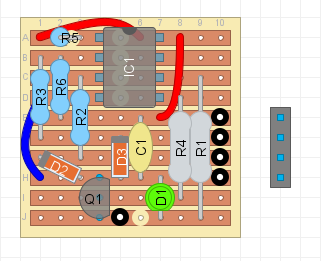

# Watchdog USB Device

Watchdog USB device is a tiny device that restarts a PC in case it freezes. It is designed to be plugged directly into a USB header on the PC's motherboard.

## How does it work

The device (also *Watchdog*), when plugged into an USB port, listens for periodic pulses (also *kicks*) from a software (also *Pulser*) running on the PC and triggers a hardware restart in case it does not receive a kick for a specified amount of time.

When the PC boots, Pulser finds the connected Watchdog and starts sending pulses in regular intervals. Each pulse configures the Watchdog, setting its timeout, during which another pulse must be received. When the Watchdog does not receive a pulse, it triggers a hardware restart of the PC.

The timeout observed by the Watchdog is completely driven by Pulser. It must be between 1 and 65535 seconds (i.e. ca. 18 hours), or a special value of 0, which turns off the device. When a pulse is not received, Watchdog is in a grace period, by default 10 seconds, during which it may receive a pulse. When grace period expires, the Watchdog triggers the PC's restart (by sending a pulse to the restart pin on the PC's motherboard), and then waits for a new connection from the Pulser.

### LED diode

The device has a LED diode which informs the user of its current state.

| Length | Count       | Meaning                                            |
| :----- | :---------- | :------------------------------------------------- |
| Short  | 3           | Device booted successfully                         |
| Short  | 2 / sec     | Stand-by mode (timeout is indefinite)              |
| Short  | 1           | A pulse was received                               |
| Long   | 1 / sec     | Device is in grace period                          |
| Short  | Over 2 secs | **[Full brightness]** Device is triggering restart |

## Hardware

The core of the device is AVR ATTiny85 MCU. It is connected physically to a USB port header on the computer's motherboard, as well as to the reset pin.

The circuit is inspired by the Digispark by Digistump, in fact, the firmware is compatible with Digispark, however, it is not a direct clone of the device.

It is designed to fit on a 10 by 10 strip board. A 4-pin connector is soldered directly to the board, so that the board can be plugged directly into the USB header, and an additional cable ending with a dupont 1-pin female connector which is plugged to the restart pin of the motherboard.

## Firmware

The firmware is written in C++, with Arduino. In its current form, ATTinyCore is used, however, I am certain that almost any other arduino core for ATTiny85 would work.

The `libraries/DigisparkUSB` directory contains the library responsible for the USB communication and it is taken from an arduino core developed for Digispark. It is modified so that the device acts as a Vendor class device instead of a HID device. This modification allows us to implement `handleVendorRequest` function and handle our custom vendor requests.

Because the USB wiring is identical to the one of Digispark, Micronucleus can be used to flash the firmware onto the device. I have tested Micronucleus version 2.6. Burning the bootloader onto the chip is out of the scope of this manual.

Additionally, fuses must be set so that the chip runs at 16.5 MHz, otherwise the USB won't work.

Example of command to burn the boot loader and setting fuses using Arduino as ISP could be:

    avrdude -c arduino -p t85 -P /dev/ttyACM0 -b 19200 \
      -U lfuse:w:0xe1:m -U hfuse:w:0xdd:m -U efuse:w:0xfe:m \
      -U flash:w:/path/to/micronucleus-2.6.hex:i

It is possible that the firmware also works without a bootloader, but that is an untested configuration.
